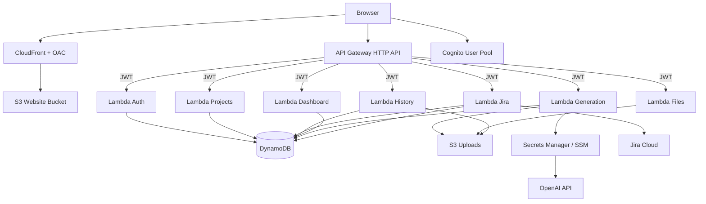

# Kaldi One — AWS Architecture

## High-level diagram

## DynamoDB single-table design

| PK | SK | Purpose | GSI1PK | GSI1SK |
|----|-----|---------|--------|--------|
| `USER#{userId}` | `PROFILE` | User profile / bootstrap flag | — | — |
| `USER#{userId}` | `PROJECT#{projectId}` | Project metadata | — | — |
| `USER#{userId}` | `ITEM#{createdAt}#{itemId}` | Saved generation | `USER#{userId}#PROJECT#{projectId}` | `ITEM#{createdAt}#{itemId}` |
| `USER#{userId}` | `JIRA` | Jira config + encrypted token | — | — |

**Access patterns**

- List projects: Query PK = `USER#id`, SK begins_with `PROJECT#`
- List history (all): Query PK, SK begins_with `ITEM#`
- List history by project: Query GSI1 where GSI1PK = `USER#id#PROJECT#pid`
- Get Jira config: GetItem PK/SK `JIRA` (token stripped in API response)

## Lambda responsibilities

| Function | Routes | Memory | Timeout |
|----------|--------|--------|---------|
| auth | `POST /auth/bootstrap` | 256 | 30s |
| projects | `GET/POST /projects`, `PUT/DELETE /projects/{id}` | 256 | 30s |
| generation | `POST /generate` | 512 | 120s |
| history | `GET/POST /history`, `DELETE /history/{id}`, `POST .../export` | 512 | 60s |
| files | `POST /files/presign`, `GET /files/download` | 256 | 30s |
| jira | `GET/PUT/DELETE /jira`, `POST /jira/test`, `POST /jira/issues` | 256 | 60s |
| dashboard | `GET /dashboard` | 256 | 30s |

## Frontend delivery

1. `npm run build` → static assets
2. `aws s3 sync dist/` → website bucket (private)
3. CloudFront OAC reads objects via bucket policy conditioned on distribution ARN
4. Route53 alias A/AAAA → CloudFront
5. SPA routing: 403/404 → `index.html`

## Authentication flow

1. User signs up / signs in via `amazon-cognito-identity-js`
2. SPA stores session in Cognito SDK (refresh handled by SDK)
3. API calls send `Authorization: Bearer {idToken}`
4. API Gateway JWT authorizer validates issuer + audience (app client ID)
5. `POST /auth/bootstrap` ensures profile + default **General** project

## File upload flow

1. `POST /files/presign` → presigned PUT URL + `objectKey` under `{userId}/{projectId}/`
2. Browser uploads directly to S3
3. `POST /generate` references `objectKey`; Lambda reads object (size/MIME validated)
4. History may store `screenshotPath` for QA attachments

## Export flow

1. `POST /history/{itemId}/export` with `format`: txt | csv | xlsx
2. Lambda builds file in memory, writes to `exports/{userId}/{itemId}/`
3. Returns presigned GET URL (7-day lifecycle on prefix)

## IAM least privilege

Lambda role grants:

- DynamoDB CRUD on app table + GSI
- S3 object R/W on uploads bucket (prefix enforced in code)
- `secretsmanager:GetSecretValue` or `ssm:GetParameter` for OpenAI only

No VPC, no NAT, no broad `s3:*`.

## Observability

- Lambda logs → CloudWatch (retention from parameter)
- API Gateway access logs → dedicated log group

## Optional enhancements (not in baseline template)

- AWS WAF on CloudFront (disabled by default)
- Cognito Hosted UI / federated IdPs
- Step Functions for long-running multi-step PDF flows
- OpenSearch for advanced history search
